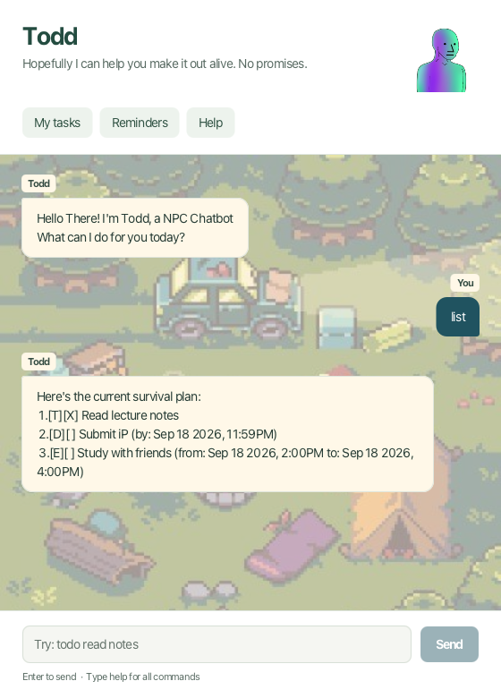

# Todd — User Guide

*Hopefully I can help you make it out alive. No promises.*

Todd is your NPC task companion. Add todos, deadlines, and events, then track your progress
through a chat window.



## Quick start

1. Install **Java 25**. Run `java -version` in a terminal to check your version.
2. Download the application JAR from [Todd's releases](https://github.com/aayushi122/ip/releases)
   and put it in a folder where you can save files.
3. Open a terminal in that folder and run:

   ```sh
   java -jar todd.jar
   ```

4. In Todd, type `todo Read notes` and press **Enter** or click **Send**.
5. Type `list` to see your task, or `help` to explore the commands.

Type one command at a time. **My tasks**, **Reminders**, and **Help** are shortcuts for
`list`, `reminders`, and `help`. They keep any unfinished command in the input box.
You can resize the window and scroll through the conversation.

## Add tasks

### Todo — a task without a date
**Format:** `todo <description>`
**Example:** `todo Read notes`

Todd adds an unfinished task, displays it, and shows your updated task count.

### Deadline — a task with a due date
**Format:** `deadline <description> /by <date> [HHmm]`
**Example:** `deadline Submit report /by tomorrow 1800`

Todd adds the task with a deadline of tomorrow at 6:00pm. Use `/by` once.

### Event — something with a start and end
**Format:** `event <description> /from <date> [HHmm] /to <date> [HHmm]`
**Example:** `event Study with friends /from today 1400 /to today 1600`

Todd adds an event from 2:00pm to 4:00pm today. Use `/from` before `/to`, once each.

## View and find

### See everything
**Command/example:** `list`

Shows all tasks, including completed ones, with their task numbers.
`[T]` means todo, `[D]` deadline, and `[E]` event. `[X]` means done; `[ ]` means unfinished.
For example, `1.[T][X] Read notes` is a completed todo numbered 1.

### Find by description
**Format:** `find <keyword>`
**Example:** `find notes`

Shows descriptions containing `notes`. Matching is **case-sensitive**
You can also search for a phrase, such as `find Study with friends`.
Results retain their original task numbers.

### Check a date
**Format:** `on <date>`
**Example:** `on tomorrow`

Shows deadlines due on that date and events spanning it, including completed tasks.
Both the start and end dates of an event are included. Todos have no date and are excluded.

### Check what's coming up

**Command/example:** `reminders`

Shows unfinished deadlines and events from **today through six days after today**, inclusive.

## Update tasks

Use the number displayed by `list`, `find`, `on`, or `reminders`.

| Action | Format | Example | Result |
| --- | --- | --- | --- |
| Complete a task | `mark <task number>` | `mark 1` | Changes task 1 to `[X]`. |
| Reopen a task | `unmark <task number>` | `unmark 1` | Changes task 1 to `[ ]`. |
| Remove a task | `delete <task number>` | `delete 1` | Removes task 1 and shows the remaining count. |

**Deletion has no undo command**, and later task numbers shift down after deletion.
Use `list` again before choosing another task number.

## Chat, help, and exit

- `hi` or `hello`: Todd replies `Supp`.
- `help`: displays command formats and examples.
- `bye`: displays a farewell and closes Todd after about one second.

These commands, `list`, and `reminders` take no extra arguments.

## Dates and times

- Use a real date in `yyyy-MM-dd` format, such as `2026-09-18`, or a date word:
  `today`, `tomorrow`, `Mon`, or `Monday`.
- Weekdays mean their **next occurrence**. On Monday, `Mon` means the following Monday.
- Date words ignore capitalization and use your computer's current local date.
- Times use four-digit, 24-hour `HHmm`: `0900` is 9:00am; `1430` is 2:30pm.
- Leaving out the time means midnight at the start of that date. Midnight is displayed as a date only.
- Relative dates are resolved when you add a task; they do not move forward each day.

## Saving and troubleshooting

Todd automatically saves successful task changes to `data/todd.txt` inside the folder
from which you launch it. Chat history is not saved. Launch from the same folder to reuse your list.

| Problem | What to do |
| --- | --- |
| Unknown command or missing details | Type `help`, then follow the format. Descriptions must be nonempty, stay on one line, and contain no `\|` character. |
| Invalid date or time | Check the actual calendar date and use a time from `0000` to `2359`. |
| Task number doesn't exist | Run `list` and choose an existing positive number. |
| No saved data file | Todd starts with an empty list and creates the file when you add a task. Check your launch folder if you expected existing tasks. |
| Saved data cannot be loaded | Todd disables task changes to protect the file. Back it up before correcting it, check access permissions, then restart. |
| Changes cannot be saved | The attempted change is reversed. Check folder permissions and free space; try a writable local folder if needed. |

## Credits

See [project and artwork credits](https://github.com/aayushi122/ip/blob/master/CREDITS.md)
for the original sources and development contributions.
